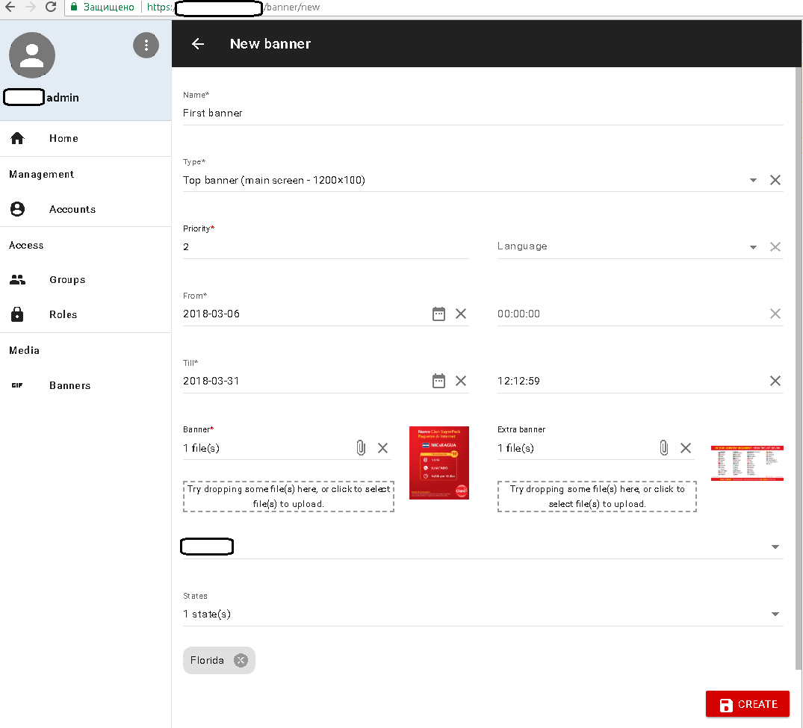
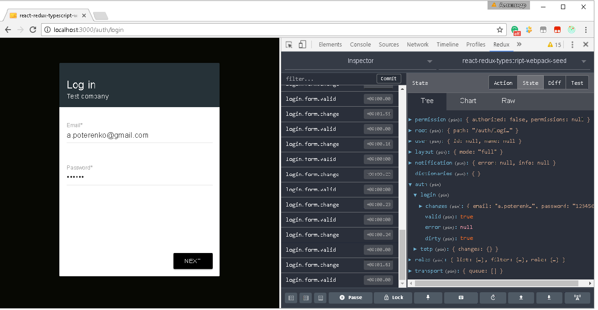
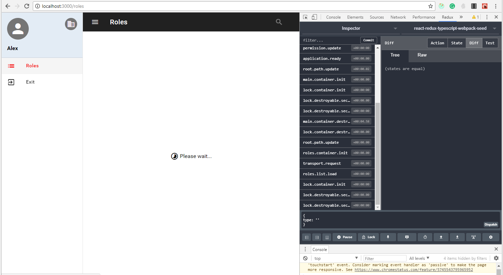
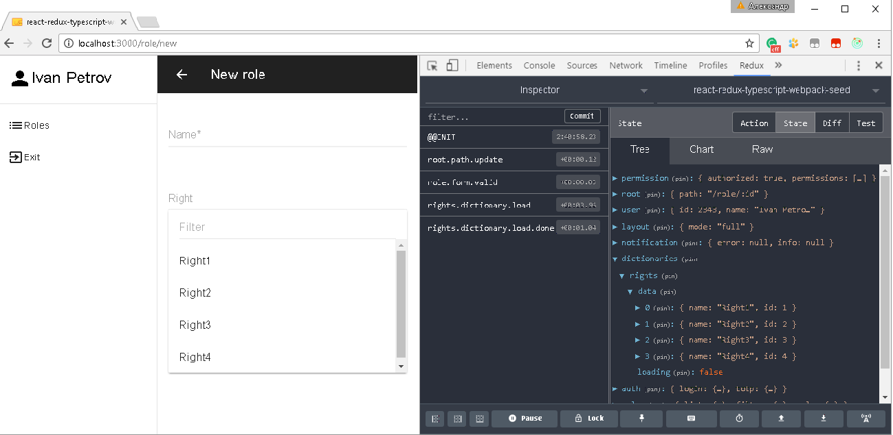
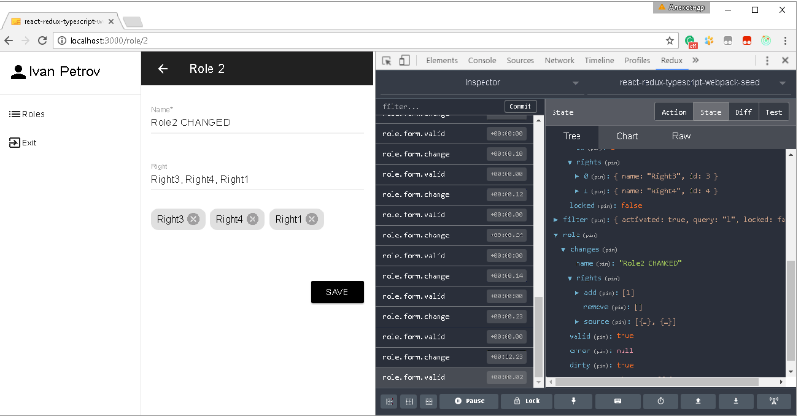
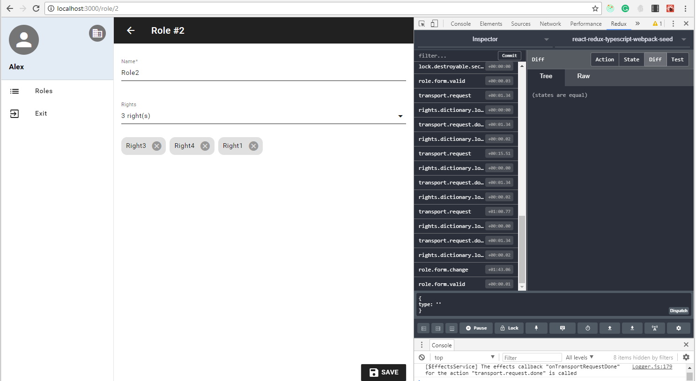

# react-redux-typescript-webpack-seed

#### Install

* npm install
* npm install --production

#### Build

* npm run build
* npm run build:dev
* npm run build:prod

#### Debug

* npm run server:json
* npm start

# Live demo

[Live demo](https://apoterenko.github.io/react-redux-typescript-webpack-seed)

# Preview

## License

Licensed under MIT.